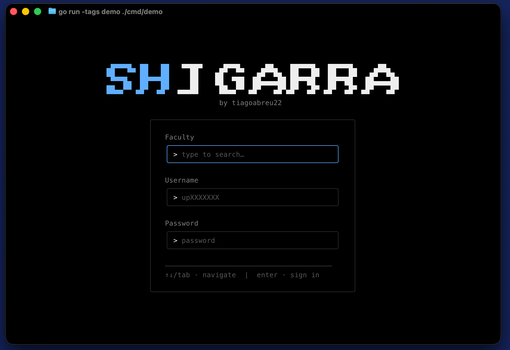
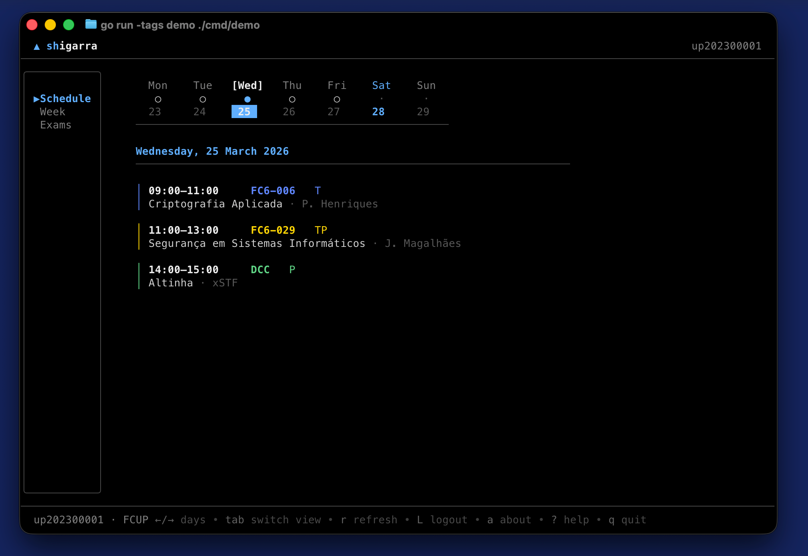
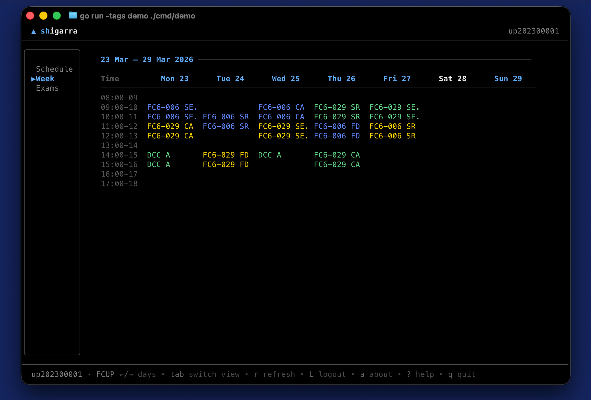
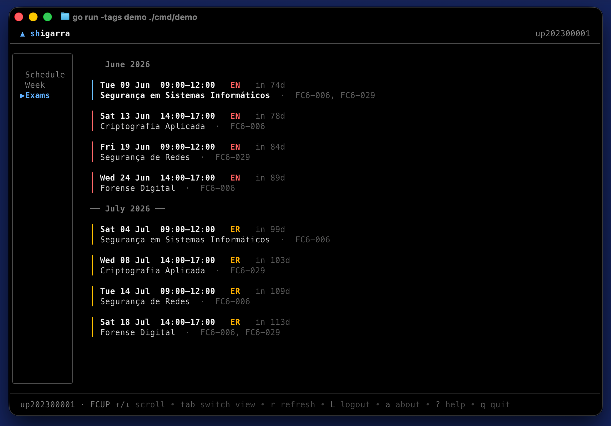

# Shigarra

Manage Sigarra from the comfort of your terminal. Why use a web browser when you can do it from a TUI?


Written in Go with [Bubbletea](https://github.com/charmbracelet/bubbletea), Shigarra allows you to quickly check your schedule, classroom and exams. It can manage your session securely so that you dont need to waste time. Inspired by [uni-niaefeup](https://github.com/niaefeup/uni)

<details>
<summary>Screenshots</summary>






</details>

## Install

**Homebrew** (macOS / Linux)

```bash
brew tap tiagoabreu22/shigarra
brew install shigarra
```

**Go** (macOS / Linux / Windows)

```bash
go install github.com/tiagoabreu22/shigarra@latest
```

## Build from source

```bash
git clone https://github.com/tiagoabreu22/shigarra.git
cd shigarra
go build
./shigarra
```

## Usage

```bash
shigarra                  # interactive TUI
shigarra --version        # print version
shigarra dump schedule    # export schedule as JSON
shigarra dump exams       # export exams as JSON
```
# RoadMap
- [x] Schedule
- [x] Exams
- [ ] Vim motions
- [ ] Grades / ECTS
- [ ] Financial & Payments
- [ ] Find where teachers are
- [ ] Cafetria menu and reservations
